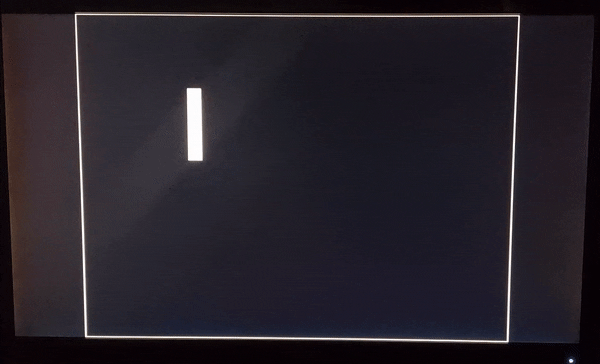

# CPU 6502

A modern (2023) assembler, simulator and hardware description of the [W65C02S](https://www.westerndesigncenter.com/wdc/w65c02s-chip.php).

 

Shown above is video recording of an example snake game running on a softcore model of the W65C02S on a completely standalone FPGA in realtime. 

---

## Assembler
- The Assembler can be used to successfully assemble code specifically for the 6502 into either binary files ".hex" for the simulator or ".mif" for the hardware description. 
- Check utils/config.py to modify default vectors, output mode, etc.

### Usage

```
$ python3 assembler.py "filename.asm"
```

---

## Simulator
- The simulator can be used to imitate the exact instructions of the 6502 down to each cycle. It can track and monitor values in all registers and counters along with other critical information.
- Along with the simulator, there is a built in display along with a keyboard correlating to certain memory addresses in order to further stimulate the reality of the processor.
- Inside the main "simulator.py" script, each instruction is broken down by opcode and execute cycle by cycle with detailed instructions for simple understanding.
- Check utils/config.py to modify default vectors, simulation settings, etc.

### Dependencies
```
$ pip install readchar
$ pip install pygame
```

### Usage
```
$ python3 simulator.py "filename.hex"
```

---

## Hardware
- The hardware contains verilog code which can be compiled for accurate depiction of RTL, simulated in waveforms, or programmed to FPGA of choosing for realtime emulation.
- The hardware is broken down into two seperate folders: CPU and Computer.
- CPU contains an accurate description of the W65C02S of all parts including control unit, arithemtic unit, all registers, etc written in verilog. Use this folder if you wish to solely simulate the processor.
- Computer contains the processor integrated with memory, keyboard/keypad, and display in order to realisticly portray the W65C02S in all of its glory on an FPGA.

### Dependencies

- To Simulate "CPU": Must have verilog simulators such as Verilator, Icarus, or even synthesis tools including Quartus Prime or Xilinx Vivado.

- To Run "Computer" on FPGA: Must have an FPGA board to begin with along with EDA design software including Quartus Prime or Xilinx Vivado. Must have program "filename.mif" in "Computer" directory to successfully initialize memory.

**Quartus Prime** was used alongside the **DE10Lite** FPGA in this project.

---

## License
This is published under the [MIT License](https://opensource.org/licenses/MIT).
